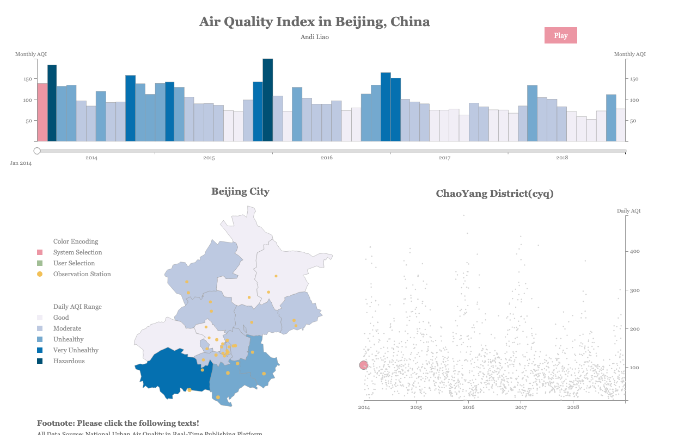

# Air Quality Index in Beijing, China

An interactive D3.js visualization exploring air quality patterns in Beijing (2014-2018), with animated timeline, district-level maps, and scatterplots.

**[Live Demo](https://liaoandi.github.io/MainlandChina_AQI_D3/)**

## Features

- Animated monthly AQI bar chart with play/pause control
- Interactive Beijing district map with color-coded AQI levels
- Scatterplot of daily AQI by monitoring station
- Linked views: clicking a district updates all charts

## Tech Stack

D3.js, JavaScript, HTML/CSS, GeoJSON
